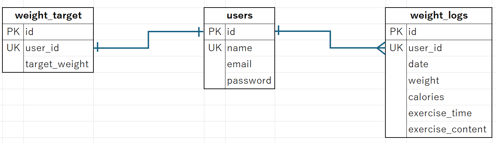

# 体重管理システム

## 環境構築

#### Docker ビルド
1. `$ git clone git@github.com:akio0121/weight-form.git`
2. DockerDesktopアプリを起動する。
3. `$ docker-compose up -d --build`

#### Laravel 環境構築
```bash
$ docker-compose exec php bash
$ composer install
```
`.env.example`ファイルを`.env`ファイルに命名を変更する。
```bash
$ php artisan key:generate
$ php artisan migrate
$ php artisan db:seed
```

#### ダミーデータ

| 名前  | メールアドレス | パスワード |
| ----- | -------------- | ---------- |
| 山田太郎 | aaa@bbb.com    | aaa   |

## 使用技術（実行環境）
- PHP 7.4.9
- MySQL 8.0.26
- Laravel 8.83.8

### ER 図



### URL
- 開発環境 http://localhost/login
- phpMyAdmin http://localhost:8080/
